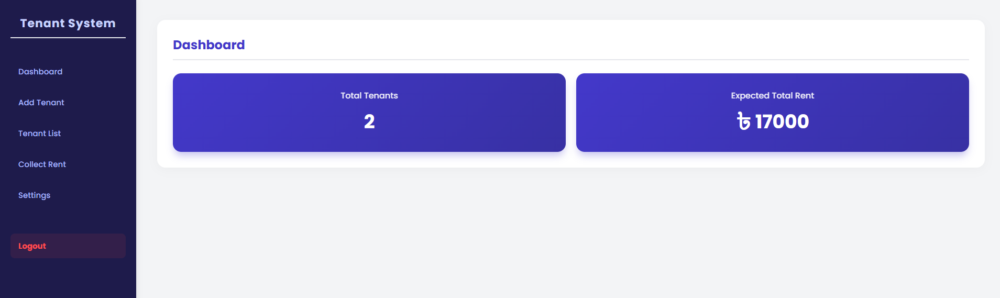
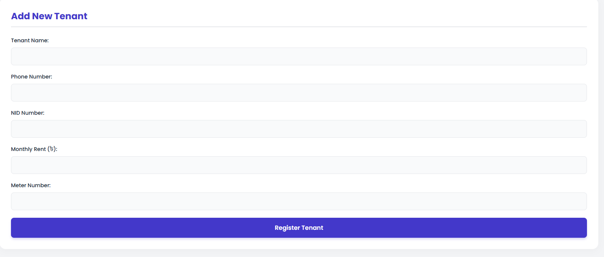
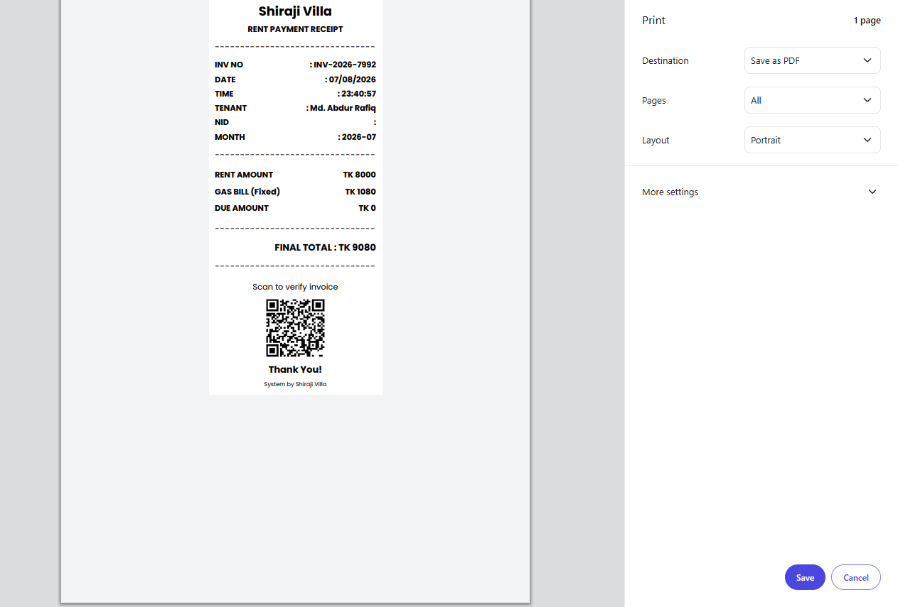
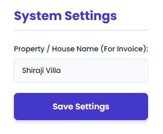

# 🏠 Shiraji Villa — Tenant Management System

A lightweight, browser-based **Tenant & Rent Management System** built with vanilla HTML/CSS/JavaScript and **Firebase** (Authentication + Firestore). Designed for landlords/property managers to register tenants, track monthly rent, print thermal-style POS invoices, and manage everything from a clean, modern dashboard — no backend server required.



---

## ✨ Features

- 🔐 **Admin Login** — Secure sign-in via Firebase Authentication (Email/Password)
- 📊 **Dashboard** — At-a-glance view of total tenants and expected total rent
- ➕ **Add Tenant** — Register tenants with name, phone, NID, monthly rent, and meter number
- 📋 **Tenant List** — Searchable table (by name, phone, or NID) with active/inactive status badges
- ✏️ **Edit Tenant** — Update tenant details anytime via a modal form
- 🔁 **Toggle Status** — Mark tenants active/inactive without deleting their records
- 💵 **Collect Rent** — Log monthly rent payments with paid/due amount tracking
- 🧾 **POS Invoice Printing** — Auto-generated 80mm thermal-printer-style receipt with a QR code for invoice verification
- 🕘 **Rent History** — View a tenant's full payment history in a popup modal
- ⚙️ **Settings** — Customize the property/house name shown on invoices
- 📱 Fully responsive, modern UI (Poppins font, indigo/navy theme)

---

## 📸 Screenshots

| Dashboard | Add Tenant |
|---|---|
|  |  |

| Printable Invoice | Settings |
|---|---|
|  |  |

---

## 🛠️ Tech Stack

- **Frontend:** HTML5, CSS3, Vanilla JavaScript (ES Modules)
- **Backend / Database:** [Firebase](https://firebase.google.com/) (Firestore + Authentication)
- **Fonts:** [Poppins](https://fonts.google.com/specimen/Poppins) via Google Fonts
- **QR Code:** [QR Server API](https://goqr.me/api/) (for invoice verification codes)
- **Hosting:** Any static host (GitHub Pages, Netlify, Vercel, Firebase Hosting, etc.)

No build tools, no `npm install`, no framework — just open `index.html` in a browser (after Firebase setup).

---

## 📁 Project Structure

```
tenant-management-system/
├── index.html          # Main HTML structure (login, dashboard, forms, modals, invoice)
├── style.css            # All UI styling (theme, layout, tables, invoice, login)
├── app.js                # Firebase config + all app logic (auth, CRUD, invoice, search)
└── screenshots/          # App screenshots used in this README
```

---

## 🚀 Getting Started

Follow these steps to run your own copy of this project.

### 1. Clone the repository

```bash
git clone https://github.com/<your-username>/tenant-management-system.git
cd tenant-management-system
```

### 2. Create a Firebase Project

1. Go to the [Firebase Console](https://console.firebase.google.com/) and click **Add project**.
2. Give it a name (e.g. `my-tenant-system`) and finish the setup wizard.

### 3. Enable Authentication

1. In your Firebase project, go to **Build → Authentication → Get started**.
2. Under **Sign-in method**, enable **Email/Password**.
3. Go to the **Users** tab and click **Add user** to create your admin login (this email/password is what you'll use to log into the dashboard).

### 4. Create a Firestore Database

1. Go to **Build → Firestore Database → Create database**.
2. Choose **Start in production mode** (recommended) or test mode.
3. Select a Cloud Firestore location close to you.

> ⚠️ If you start in production mode, you'll need to set Firestore **Security Rules** so only authenticated users (your admin) can read/write data. Example starter rule:
> ```
> rules_version = '2';
> service cloud.firestore {
>   match /databases/{database}/documents {
>     match /{document=**} {
>       allow read, write: if request.auth != null;
>     }
>   }
> }
> ```

### 5. Get your Firebase Config

1. In the Firebase Console, go to **Project settings** (gear icon) → **General**.
2. Under **Your apps**, click the **Web (`</>`)** icon to register a new web app.
3. Copy the `firebaseConfig` object shown.

### 6. Add your config to the project

Open `app.js` and replace the placeholder config at the top of the file with your own:

```javascript
const firebaseConfig = {
  apiKey: "YOUR_API_KEY",
  authDomain: "YOUR_PROJECT.firebaseapp.com",
  projectId: "YOUR_PROJECT_ID",
  storageBucket: "YOUR_PROJECT.firebasestorage.app",
  messagingSenderId: "YOUR_SENDER_ID",
  appId: "YOUR_APP_ID"
};
```

> 🔒 **Note:** Firebase web API keys are safe to expose publicly by design — access is controlled by your Firestore Security Rules and Authentication, not by hiding the key. Just make sure your **Security Rules** (Step 4) are properly configured before going live.

### 7. Run the project locally

Since `app.js` uses ES Modules (`type="module"`), you can't just double-click `index.html` — it needs to be served over `http://` (not `file://`). Use any local server, for example:

```bash
# Using Python
python3 -m http.server 8000

# OR using Node.js (npx)
npx serve .
```

Then open `http://localhost:8000` in your browser.

### 8. Log in

Use the admin email/password you created in **Step 3** to log into the dashboard.

---

## 🌐 Deploying

You can deploy this as a static site on any of the following:

- **Firebase Hosting** — `firebase init hosting` → `firebase deploy`
- **GitHub Pages** — push to a repo and enable Pages in Settings
- **Netlify / Vercel** — drag-and-drop or connect your GitHub repo

---

## 🖨️ How Invoicing Works

When you save a rent payment under **Collect Rent**, the system:
1. Generates a unique invoice number and timestamp
2. Renders an 80mm thermal-printer-style receipt (via `@media print` CSS)
3. Embeds a QR code (via QR Server API) for invoice verification
4. Opens the browser's print dialog so you can print or save it as PDF

---

## 🤝 Contributing

Contributions are welcome! Feel free to:

1. Fork the repository
2. Create a feature branch (`git checkout -b feature/your-feature`)
3. Commit your changes
4. Open a Pull Request

---

## 📄 License

This project is open-source and available under the [MIT License](LICENSE).

---

## 🙋 Author

Built by **MD Fuad Hassan Shiraji** — BSc in Software Engineering, Daffodil International University (DIU).

If you find this project useful, consider giving it a ⭐ on GitHub!
